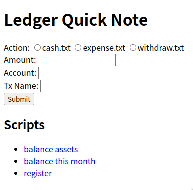
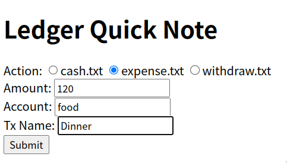
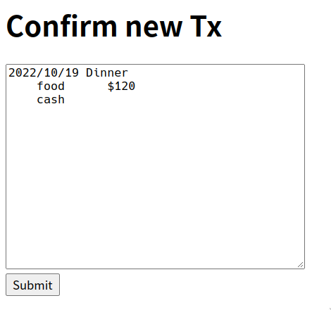
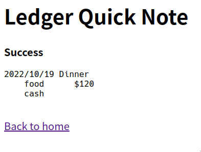
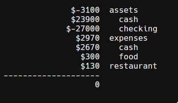

# Ledger Quick Note



**Add ledger transactions on the fly!**

## Feature

### Create Transaction from Template

Add your transaction template in `tx/` (in Go's template syntax), and create transaction from them in the browser. 

Examples:

Take some cash
```
{{ .Date }} * cash
    expenses:cash    ${{ .Amount }}
    assets:cash

```

Cash expenses
```
{{ .Date }} {{ with .Name }}{{ . }}{{ else }}{{ .Account }}{{ end }}
    {{ .Account }}      ${{ .Amount }}
    expenses:cash
    
```

Checkout `tx/` folder for more examples.



Adjust your transaction



Result page



### Ledger Scripts

Run some commonly used ledger commands.

Define your commands in config.go

```go
var SCRIPTS = map[string][]string{
	"balance assets":     {"b", "assets", "-X", "$"},
	"register":           {"r", "--tail", "10"},
	"balance this month": {"b", "-b", "this month"},
}
```

Rebuild binary everytime you make a change to `config.go`

Execute them and see the result in the browser.



## Install

Requirements:
* go
* ledger (Only required when you use scripts)
 
Install requirements on Debian / Ubuntu based distro:
```
sudo apt install golang ledger
```

Install requirements on Arch based distro:
```
sudo pacman -S golang ledger
```

Clone the repo

```
git clone https://github.com/lancatlin/ledger-quicknote.git
```

```
go build
```

```
./ledger-quicknote
```

Checkout `deployment/` for Nginx & Systemd example configuration.

